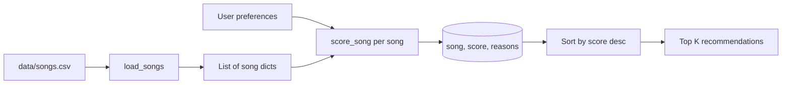

# Music Recommender Simulation

## What this is

It’s a fake recommender: songs live in a CSV, your “user” is a small dict of preferences, and the program just adds points and sorts. No training step, no API. I like that because you can read `score_song` and actually see why something ranked where it did.

Spotify-style apps mix **collaborative** stuff (people like you) with **content** stuff (tempo, mood, etc.). This project is content-only, so it’s more like “match my tags” than “learn from the crowd.”

---

## How it works (quick version)

**What’s in each song row:** the usual suspects (genre, mood, energy, tempo, valence, danceability, acousticness) plus a few extras I added for the stretch goals: popularity 0–100, release decade, mood tags separated with `|`, a rough `lyric_theme`, and `language`. If your prefs dict includes things like `target_popularity` or `favorite_mood_tags`, those columns start affecting the score too. All the nitty-gritty is in `src/recommender.py`.

**How we represent a user:**  
Either a plain dict (what `main.py` uses) or the `UserProfile` class the tests use. Same scoring underneath.

**Rough scoring idea:** points if genre lines up (I allow substring stuff so “pop” can still hit “indie pop”), points if mood matches exactly, more points if energy is *close* to what you asked for (not just “higher = better”). There’s optional valence/danceability if you add those keys. `likes_acoustic` nudges scores toward acoustic vs produced tracks.

After scoring, we sort. There’s also an optional **diversity** step so the top K doesn’t fill up with the same artist or genre over and over. The CLI prints **tables** (using `tabulate`) with a Reasons column so you’re not guessing.

### Stretch / optional pieces

I bundled four extras: extra CSV fields + math for them, a few **modes** (`balanced`, `genre_first`, `mood_first`, `energy_focused`) that scale how much each kind of signal matters, the diversity penalty above, and the table output. First profile in `main.py` runs all four modes so you can compare; the other profiles just use balanced so the terminal doesn’t go forever.

### Flow (Mermaid)



**One bias to keep in mind:** genre still carries a lot of weight. If the CSV is mostly one style, that style will keep winning even when mood or energy would have pointed somewhere else.

---

## Setup

```bash
cd ai110-module3show-musicrecommendersimulation-starter
python3 -m venv .venv
source .venv/bin/activate   # Windows: .venv\Scripts\activate
pip install -r requirements.txt
```

Run from the repo root (folder that has `data/` and `src/`):

```bash
python -m src.main
```

You should see something like `Loaded songs: 18`, then tables for different profiles.

Tests:

```bash
pytest
```

---

## Sample output (`python -m src.main`)

Captured from a local run with the bundled `data/songs.csv` and current weights. If you change scores or data, re-run and replace this block (or paste your own terminal).

```text
Loading songs from data/songs.csv...
Loaded songs: 18

Available scoring modes: balanced, energy_focused, genre_first, mood_first

## High-energy pop (default)

** Mode: balanced ** (diversity: −0.85 repeat artist, −0.40 repeat genre)

|   # | Title             | Artist        |   Score | Reasons                                                 |
|-----|-------------------|---------------|---------|---------------------------------------------------------|
|   1 | Sunrise City      | Neon Echo     |    9.82 | genre match (+2.00); mood match (+1.00); energy         |
|     |                   |               |         | alignment (+1.96; gap 0.02 from target 0.80); prefers   |
|     |                   |               |         | produced/electric (+0.98); popularity fit (+0.69; song  |
|     |                   |               |         | 78 vs target 70); era fit (+1.10; decade 2020 vs target |
|     |                   |               |         | 2020); mood tags overlap ['euphoric', 'nostalgic']      |
|     |                   |               |         | (+0.84); lyric theme match (+0.90); language match      |
|     |                   |               |         | (+0.35)                                                 |
|   2 | Rooftop Lights    | Indigo Parade |    8.29 | genre match (+2.00); mood match (+1.00); energy         |
|     |                   |               |         | alignment (+1.92; gap 0.04 from target 0.80); prefers   |
|     |                   |               |         | produced/electric (+0.78); popularity fit (+0.72; song  |
|     |                   |               |         | 66 vs target 70); era fit (+1.10; decade 2023 vs target |
|     |                   |               |         | 2020); mood tags overlap ['euphoric'] (+0.42); language |
|     |                   |               |         | match (+0.35)                                           |
|   3 | Gym Hero          | Max Pulse     |    7.37 | genre match (+2.00); energy alignment (+1.74; gap 0.13  |
|     |                   |               |         | from target 0.80); prefers produced/electric (+1.14);   |
|     |                   |               |         | popularity fit (+0.61; song 88 vs target 70); era fit   |
|     |                   |               |         | (+1.10; decade 2022 vs target 2020); mood tags overlap  |
|     |                   |               |         | ['euphoric'] (+0.42); language match (+0.35)            |
|   4 | Battery Heart     | K7 Vega       |    6.37 | energy alignment (+1.84; gap 0.08 from target 0.80);    |
|     |                   |               |         | prefers produced/electric (+1.10); popularity fit       |
|     |                   |               |         | (+0.65; song 83 vs target 70); era fit (+1.10; decade   |
|     |                   |               |         | 2021 vs target 2020); mood tags overlap ['euphoric']    |
|     |                   |               |         | (+0.42); lyric theme match (+0.90); language match      |
|     |                   |               |         | (+0.35)                                                 |
|   5 | Samba Cartography | Lua Vermelha  |    6.14 | mood match (+1.00); energy alignment (+1.84; gap 0.08   |
|     |                   |               |         | from target 0.80); prefers produced/electric (+1.06);   |
|     |                   |               |         | popularity fit (+0.72; song 74 vs target 70); era fit   |
|     |                   |               |         | (+1.10; decade 2022 vs target 2020); mood tags overlap  |
|     |                   |               |         | ['euphoric'] (+0.42)                                    |

** Mode: genre_first ** (diversity: −0.85 repeat artist, −0.40 repeat genre)

|   # | Title             | Artist        |   Score | Reasons                                                 |
|-----|-------------------|---------------|---------|---------------------------------------------------------|
|   1 | Sunrise City      | Neon Echo     |   10.05 | genre match (+3.10); mood match (+0.72); energy         |
|     |                   |               |         | alignment (+1.72; gap 0.02 from target 0.80); prefers   |
|     |                   |               |         | produced/electric (+0.93); popularity fit (+0.63; song  |
|     |                   |               |         | 78 vs target 70); era fit (+1.01; decade 2020 vs target |
|     |                   |               |         | 2020); mood tags overlap ['euphoric', 'nostalgic']      |
|     |                   |               |         | (+0.77); lyric theme match (+0.83); language match      |
|     |                   |               |         | (+0.32)                                                 |
|   2 | Rooftop Lights    | Indigo Parade |    8.63 | genre match (+3.10); mood match (+0.72); energy         |
|     |                   |               |         | alignment (+1.69; gap 0.04 from target 0.80); prefers   |
|     |                   |               |         | produced/electric (+0.74); popularity fit (+0.66; song  |
|     |                   |               |         | 66 vs target 70); era fit (+1.01; decade 2023 vs target |
|     |                   |               |         | 2020); mood tags overlap ['euphoric'] (+0.39); language |
|     |                   |               |         | match (+0.32)                                           |
|   3 | Gym Hero          | Max Pulse     |    8    | genre match (+3.10); energy alignment (+1.53; gap 0.13  |
|     |                   |               |         | from target 0.80); prefers produced/electric (+1.08);   |
|     |                   |               |         | popularity fit (+0.57; song 88 vs target 70); era fit   |
|     |                   |               |         | (+1.01; decade 2022 vs target 2020); mood tags overlap  |
|     |                   |               |         | ['euphoric'] (+0.39); language match (+0.32)            |
|   4 | Battery Heart     | K7 Vega       |    5.82 | energy alignment (+1.62; gap 0.08 from target 0.80);    |
|     |                   |               |         | prefers produced/electric (+1.05); popularity fit       |
|     |                   |               |         | (+0.60; song 83 vs target 70); era fit (+1.01; decade   |
|     |                   |               |         | 2021 vs target 2020); mood tags overlap ['euphoric']    |
|     |                   |               |         | (+0.39); lyric theme match (+0.83); language match      |
|     |                   |               |         | (+0.32)                                                 |
|   5 | Samba Cartography | Lua Vermelha  |    5.4  | mood match (+0.72); energy alignment (+1.62; gap 0.08   |
|     |                   |               |         | from target 0.80); prefers produced/electric (+1.00);   |
|     |                   |               |         | popularity fit (+0.66; song 74 vs target 70); era fit   |
|     |                   |               |         | (+1.01; decade 2022 vs target 2020); mood tags overlap  |
|     |                   |               |         | ['euphoric'] (+0.39)                                    |

** Mode: mood_first ** (diversity: −0.85 repeat artist, −0.40 repeat genre)

|   # | Title             | Artist        |   Score | Reasons                                                 |
|-----|-------------------|---------------|---------|---------------------------------------------------------|
|   1 | Sunrise City      | Neon Echo     |    9.59 | genre match (+1.56); mood match (+1.60); energy         |
|     |                   |               |         | alignment (+1.76; gap 0.02 from target 0.80); prefers   |
|     |                   |               |         | produced/electric (+0.98); popularity fit (+0.66; song  |
|     |                   |               |         | 78 vs target 70); era fit (+1.04; decade 2020 vs target |
|     |                   |               |         | 2020); mood tags overlap ['euphoric', 'nostalgic']      |
|     |                   |               |         | (+0.80); lyric theme match (+0.85); language match      |
|     |                   |               |         | (+0.33)                                                 |
|   2 | Rooftop Lights    | Indigo Parade |    8.13 | genre match (+1.56); mood match (+1.60); energy         |
|     |                   |               |         | alignment (+1.73; gap 0.04 from target 0.80); prefers   |
|     |                   |               |         | produced/electric (+0.78); popularity fit (+0.68; song  |
|     |                   |               |         | 66 vs target 70); era fit (+1.04; decade 2023 vs target |
|     |                   |               |         | 2020); mood tags overlap ['euphoric'] (+0.40); language |
|     |                   |               |         | match (+0.33)                                           |
|   3 | Gym Hero          | Max Pulse     |    6.63 | genre match (+1.56); energy alignment (+1.57; gap 0.13  |
|     |                   |               |         | from target 0.80); prefers produced/electric (+1.14);   |
|     |                   |               |         | popularity fit (+0.58; song 88 vs target 70); era fit   |
|     |                   |               |         | (+1.04; decade 2022 vs target 2020); mood tags overlap  |
|     |                   |               |         | ['euphoric'] (+0.40); language match (+0.33)            |
|   4 | Samba Cartography | Lua Vermelha  |    6.44 | mood match (+1.60); energy alignment (+1.66; gap 0.08   |
|     |                   |               |         | from target 0.80); prefers produced/electric (+1.06);   |
|     |                   |               |         | popularity fit (+0.68; song 74 vs target 70); era fit   |
|     |                   |               |         | (+1.04; decade 2022 vs target 2020); mood tags overlap  |
|     |                   |               |         | ['euphoric'] (+0.40)                                    |
|   5 | Battery Heart     | K7 Vega       |    6.01 | energy alignment (+1.66; gap 0.08 from target 0.80);    |
|     |                   |               |         | prefers produced/electric (+1.10); popularity fit       |
|     |                   |               |         | (+0.62; song 83 vs target 70); era fit (+1.04; decade   |
|     |                   |               |         | 2021 vs target 2020); mood tags overlap ['euphoric']    |
|     |                   |               |         | (+0.40); lyric theme match (+0.85); language match      |
|     |                   |               |         | (+0.33)                                                 |

** Mode: energy_focused ** (diversity: −0.85 repeat artist, −0.40 repeat genre)

|   # | Title             | Artist        |   Score | Reasons                                                 |
|-----|-------------------|---------------|---------|---------------------------------------------------------|
|   1 | Sunrise City      | Neon Echo     |    9.92 | genre match (+1.64); mood match (+0.82); energy         |
|     |                   |               |         | alignment (+3.04; gap 0.02 from target 0.80); prefers   |
|     |                   |               |         | produced/electric (+0.93); popularity fit (+0.62; song  |
|     |                   |               |         | 78 vs target 70); era fit (+0.99; decade 2020 vs target |
|     |                   |               |         | 2020); mood tags overlap ['euphoric', 'nostalgic']      |
|     |                   |               |         | (+0.76); lyric theme match (+0.81); language match      |
|     |                   |               |         | (+0.32)                                                 |
|   2 | Rooftop Lights    | Indigo Parade |    8.51 | genre match (+1.64); mood match (+0.82); energy         |
|     |                   |               |         | alignment (+2.98; gap 0.04 from target 0.80); prefers   |
|     |                   |               |         | produced/electric (+0.74); popularity fit (+0.65; song  |
|     |                   |               |         | 66 vs target 70); era fit (+0.99; decade 2023 vs target |
|     |                   |               |         | 2020); mood tags overlap ['euphoric'] (+0.38); language |
|     |                   |               |         | match (+0.32)                                           |
|   3 | Gym Hero          | Max Pulse     |    7.66 | genre match (+1.64); energy alignment (+2.70; gap 0.13  |
|     |                   |               |         | from target 0.80); prefers produced/electric (+1.08);   |
|     |                   |               |         | popularity fit (+0.55; song 88 vs target 70); era fit   |
|     |                   |               |         | (+0.99; decade 2022 vs target 2020); mood tags overlap  |
|     |                   |               |         | ['euphoric'] (+0.38); language match (+0.32)            |
|   4 | Battery Heart     | K7 Vega       |    6.98 | energy alignment (+2.85; gap 0.08 from target 0.80);    |
|     |                   |               |         | prefers produced/electric (+1.05); popularity fit       |
|     |                   |               |         | (+0.59; song 83 vs target 70); era fit (+0.99; decade   |
|     |                   |               |         | 2021 vs target 2020); mood tags overlap ['euphoric']    |
|     |                   |               |         | (+0.38); lyric theme match (+0.81); language match      |
|     |                   |               |         | (+0.32)                                                 |
|   5 | Samba Cartography | Lua Vermelha  |    6.69 | mood match (+0.82); energy alignment (+2.85; gap 0.08   |
|     |                   |               |         | from target 0.80); prefers produced/electric (+1.00);   |
|     |                   |               |         | popularity fit (+0.65; song 74 vs target 70); era fit   |
|     |                   |               |         | (+0.99; decade 2022 vs target 2020); mood tags overlap  |
|     |                   |               |         | ['euphoric'] (+0.38)                                    |


## Chill lofi room

** Mode: balanced ** (diversity: −0.85 repeat artist, −0.40 repeat genre)

|   # | Title              | Artist         |   Score | Reasons                                                  |
|-----|--------------------|----------------|---------|----------------------------------------------------------|
|   1 | Midnight Coding    | LoRoom         |    9.58 | genre match (+2.00); mood match (+1.00); energy          |
|     |                    |                |         | alignment (+1.86; gap 0.07 from target 0.35); prefers    |
|     |                    |                |         | acoustic (+0.85); popularity fit (+0.67; song 55 vs      |
|     |                    |                |         | target 45); era fit (+1.10; decade 2019 vs target 2020); |
|     |                    |                |         | mood tags overlap ['calm', 'focused'] (+0.84); lyric     |
|     |                    |                |         | theme match (+0.90); language match (+0.35)              |
|   2 | Library Rain       | Paper Lanterns |    9.53 | genre match (+2.00); mood match (+1.00); energy          |
|     |                    |                |         | alignment (+2.00; gap 0.00 from target 0.35); prefers    |
|     |                    |                |         | acoustic (+1.03); popularity fit (+0.73; song 48 vs      |
|     |                    |                |         | target 45); era fit (+1.10; decade 2021 vs target 2020); |
|     |                    |                |         | mood tags overlap ['calm'] (+0.42); lyric theme match    |
|     |                    |                |         | (+0.90); language match (+0.35)                          |
|   3 | Focus Flow         | LoRoom         |    7.82 | genre match (+2.00); energy alignment (+1.90; gap 0.05   |
|     |                    |                |         | from target 0.35); prefers acoustic (+0.94); popularity  |
|     |                    |                |         | fit (+0.70; song 52 vs target 45); era fit (+1.10;       |
|     |                    |                |         | decade 2020 vs target 2020); mood tags overlap ['calm',  |
|     |                    |                |         | 'focused'] (+0.84); language match (+0.35)               |
|   4 | Rain on Tin Roof   | The Mayhews    |    6.66 | mood match (+1.00); energy alignment (+1.92; gap 0.04    |
|     |                    |                |         | from target 0.35); prefers acoustic (+1.13); popularity  |
|     |                    |                |         | fit (+0.74; song 44 vs target 45); era fit (+1.10;       |
|     |                    |                |         | decade 2018 vs target 2020); mood tags overlap ['calm']  |
|     |                    |                |         | (+0.42); language match (+0.35)                          |
|   5 | Spacewalk Thoughts | Orbit Bloom    |    6.55 | mood match (+1.00); energy alignment (+1.86; gap 0.07    |
|     |                    |                |         | from target 0.35); prefers acoustic (+1.10); popularity  |
|     |                    |                |         | fit (+0.72; song 41 vs target 45); era fit (+1.10;       |
|     |                    |                |         | decade 2017 vs target 2020); mood tags overlap ['calm']  |
|     |                    |                |         | (+0.42); language match (+0.35)                          |


## Deep intense rock

** Mode: balanced ** (diversity: −0.85 repeat artist, −0.40 repeat genre)

|   # | Title             | Artist        |   Score | Reasons                                                 |
|-----|-------------------|---------------|---------|---------------------------------------------------------|
|   1 | Storm Runner      | Voltline      |    9.98 | genre match (+2.00); mood match (+1.00); energy         |
|     |                   |               |         | alignment (+1.98; gap 0.01 from target 0.90); prefers   |
|     |                   |               |         | produced/electric (+1.08); popularity fit (+0.73; song  |
|     |                   |               |         | 62 vs target 65); era fit (+1.10; decade 2018 vs target |
|     |                   |               |         | 2020); mood tags overlap ['aggressive', 'euphoric']     |
|     |                   |               |         | (+0.84); lyric theme match (+0.90); language match      |
|     |                   |               |         | (+0.35)                                                 |
|   2 | Redline Tesseract | Iron Circuit  |    6.95 | mood match (+1.00); energy alignment (+1.88; gap 0.06   |
|     |                   |               |         | from target 0.90); prefers produced/electric (+1.15);   |
|     |                   |               |         | popularity fit (+0.63; song 81 vs target 65); era fit   |
|     |                   |               |         | (+1.10; decade 2023 vs target 2020); mood tags overlap  |
|     |                   |               |         | ['aggressive', 'euphoric'] (+0.84); language match      |
|     |                   |               |         | (+0.35)                                                 |
|   3 | Gym Hero          | Max Pulse     |    6.95 | mood match (+1.00); energy alignment (+1.94; gap 0.03   |
|     |                   |               |         | from target 0.90); prefers produced/electric (+1.14);   |
|     |                   |               |         | popularity fit (+0.58; song 88 vs target 65); era fit   |
|     |                   |               |         | (+1.10; decade 2022 vs target 2020); mood tags overlap  |
|     |                   |               |         | ['aggressive', 'euphoric'] (+0.84); language match      |
|     |                   |               |         | (+0.35)                                                 |
|   4 | Battery Heart     | K7 Vega       |    5.97 | energy alignment (+1.96; gap 0.02 from target 0.90);    |
|     |                   |               |         | prefers produced/electric (+1.10); popularity fit       |
|     |                   |               |         | (+0.61; song 83 vs target 65); era fit (+1.10; decade   |
|     |                   |               |         | 2021 vs target 2020); mood tags overlap ['aggressive',  |
|     |                   |               |         | 'euphoric'] (+0.84); language match (+0.35)             |
|   5 | Rooftop Lights    | Indigo Parade |    5.11 | energy alignment (+1.72; gap 0.14 from target 0.90);    |
|     |                   |               |         | prefers produced/electric (+0.78); popularity fit       |
|     |                   |               |         | (+0.74; song 66 vs target 65); era fit (+1.10; decade   |
|     |                   |               |         | 2023 vs target 2020); mood tags overlap ['euphoric']    |
|     |                   |               |         | (+0.42); language match (+0.35)                         |


## Adversarial — moody + max energy

** Mode: balanced ** (diversity: −0.85 repeat artist, −0.40 repeat genre)

|   # | Title            | Artist        |   Score | Reasons                                                |
|-----|------------------|---------------|---------|--------------------------------------------------------|
|   1 | Sunrise City     | Neon Echo     |    7.81 | genre match (+2.00); energy alignment (+1.74; gap 0.13 |
|     |                  |               |         | from target 0.95); prefers produced/electric (+0.98);  |
|     |                  |               |         | popularity fit (+0.73; song 78 vs target 80); era fit  |
|     |                  |               |         | (+1.10; decade 2020 vs target 2021); lyric theme match |
|     |                  |               |         | (+0.90); language match (+0.35)                        |
|   2 | Gym Hero         | Max Pulse     |    7.24 | genre match (+2.00); energy alignment (+1.96; gap 0.02 |
|     |                  |               |         | from target 0.95); prefers produced/electric (+1.14);  |
|     |                  |               |         | popularity fit (+0.69; song 88 vs target 80); era fit  |
|     |                  |               |         | (+1.10; decade 2022 vs target 2021); language match    |
|     |                  |               |         | (+0.35)                                                |
|   3 | Night Drive Loop | Neon Echo     |    6.99 | mood match (+1.00); energy alignment (+1.60; gap 0.20  |
|     |                  |               |         | from target 0.95); prefers produced/electric (+0.94);  |
|     |                  |               |         | popularity fit (+0.68; song 71 vs target 80); era fit  |
|     |                  |               |         | (+1.10; decade 2021 vs target 2021); mood tags overlap |
|     |                  |               |         | ['moody'] (+0.42); lyric theme match (+0.90); language |
|     |                  |               |         | match (+0.35)                                          |
|   4 | Rooftop Lights   | Indigo Parade |    6.49 | genre match (+2.00); energy alignment (+1.62; gap 0.19 |
|     |                  |               |         | from target 0.95); prefers produced/electric (+0.78);  |
|     |                  |               |         | popularity fit (+0.65; song 66 vs target 80); era fit  |
|     |                  |               |         | (+1.10; decade 2023 vs target 2021); language match    |
|     |                  |               |         | (+0.35)                                                |
|   5 | Battery Heart    | K7 Vega       |    6.04 | energy alignment (+1.86; gap 0.07 from target 0.95);   |
|     |                  |               |         | prefers produced/electric (+1.10); popularity fit      |
|     |                  |               |         | (+0.73; song 83 vs target 80); era fit (+1.10; decade  |
|     |                  |               |         | 2021 vs target 2021); lyric theme match (+0.90);       |
|     |                  |               |         | language match (+0.35)                                 |


--- Quick copy: pop profile, balanced + diversity ---

|   # | Title             | Artist        |   Score | Reasons                                                 |
|-----|-------------------|---------------|---------|---------------------------------------------------------|
|   1 | Sunrise City      | Neon Echo     |    9.82 | genre match (+2.00); mood match (+1.00); energy         |
|     |                   |               |         | alignment (+1.96; gap 0.02 from target 0.80); prefers   |
|     |                   |               |         | produced/electric (+0.98); popularity fit (+0.69; song  |
|     |                   |               |         | 78 vs target 70); era fit (+1.10; decade 2020 vs target |
|     |                   |               |         | 2020); mood tags overlap ['euphoric', 'nostalgic']      |
|     |                   |               |         | (+0.84); lyric theme match (+0.90); language match      |
|     |                   |               |         | (+0.35)                                                 |
|   2 | Rooftop Lights    | Indigo Parade |    8.29 | genre match (+2.00); mood match (+1.00); energy         |
|     |                   |               |         | alignment (+1.92; gap 0.04 from target 0.80); prefers   |
|     |                   |               |         | produced/electric (+0.78); popularity fit (+0.72; song  |
|     |                   |               |         | 66 vs target 70); era fit (+1.10; decade 2023 vs target |
|     |                   |               |         | 2020); mood tags overlap ['euphoric'] (+0.42); language |
|     |                   |               |         | match (+0.35)                                           |
|   3 | Gym Hero          | Max Pulse     |    7.37 | genre match (+2.00); energy alignment (+1.74; gap 0.13  |
|     |                   |               |         | from target 0.80); prefers produced/electric (+1.14);   |
|     |                   |               |         | popularity fit (+0.61; song 88 vs target 70); era fit   |
|     |                   |               |         | (+1.10; decade 2022 vs target 2020); mood tags overlap  |
|     |                   |               |         | ['euphoric'] (+0.42); language match (+0.35)            |
|   4 | Battery Heart     | K7 Vega       |    6.37 | energy alignment (+1.84; gap 0.08 from target 0.80);    |
|     |                   |               |         | prefers produced/electric (+1.10); popularity fit       |
|     |                   |               |         | (+0.65; song 83 vs target 70); era fit (+1.10; decade   |
|     |                   |               |         | 2021 vs target 2020); mood tags overlap ['euphoric']    |
|     |                   |               |         | (+0.42); lyric theme match (+0.90); language match      |
|     |                   |               |         | (+0.35)                                                 |
|   5 | Samba Cartography | Lua Vermelha  |    6.14 | mood match (+1.00); energy alignment (+1.84; gap 0.08   |
|     |                   |               |         | from target 0.80); prefers produced/electric (+1.06);   |
|     |                   |               |         | popularity fit (+0.72; song 74 vs target 70); era fit   |
|     |                   |               |         | (+1.10; decade 2022 vs target 2020); mood tags overlap  |
|     |                   |               |         | ['euphoric'] (+0.42)                                    |
```

---

## Stuff I tried

I temporarily changed the constants in `recommender.py`: lower genre weight, higher energy weight, ran again. The list shifted toward whoever sat near the target energy, even when another song was a “truer” genre match. Kind of what I expected.

I also mentally removed the mood line (didn’t leave it commented out in the repo) and noticed happy vs intense pop would blur together more. So mood was doing real work for those cases.

---

## Honest limitations

Eighteen fake songs is not a catalog. No lyrics, no social signals, no “you listened to this last week.” Genre substring matching is handy for a tiny dataset but could get weird if someone names genres carelessly.

More detail in [`model_card.md`](model_card.md) and the informal notes in [`reflection.md`](reflection.md).

---

## Tiny reflection

Before this, recommenders felt like a black box. After, it’s mostly: define features, pick weights, sort. The part that still feels “AI-ish” to people is really just which weights and which data someone chose. I used tests to catch dumb mistakes; for whether the rankings “feel right,” I still had to use my own judgment on the fake profiles.
