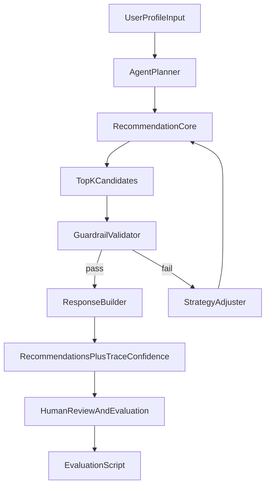

# Agentic Music Recommendation System

This project extends my Module 3 base project, **Music Recommender Simulation**. The original version ranked songs from a CSV using weighted rules (genre, mood, energy, acoustic preference) and printed transparent reasons for each score. It was deterministic and explainable, but it did not include an agent loop, reliability checks, or structured evaluation.

The final version adds an **agentic workflow** that plans strategy, runs recommendations, validates outputs with guardrails, and repairs strategy when checks fail.

## Why this matters

A recommender that only ranks can still produce brittle results. This build focuses on trust: intermediate trace steps, confidence scoring, validation checks, and repeatable evaluation so behavior is measurable, not just subjective.

## Repository structure

- `src/recommender.py` - core deterministic scoring engine.
- `src/agent.py` - plan/act/check/repair orchestration.
- `src/guardrails.py` - confidence scoring + validation checks.
- `src/main.py` - end-to-end CLI demo (agentic or baseline mode).
- `src/evaluate.py` - reliability harness over predefined scenarios.
- `tests/` - unit tests for recommender and agentic behavior.
- `assets/system_architecture.md` - architecture diagram.
- `model_card.md` - ethics, reliability, and AI collaboration reflection.

## Architecture overview



Agent loop:
1. **Plan** selects scoring mode + diversity strategy from user profile.
2. **Act** generates top-k recommendations.
3. **Check** validates confidence and diversity guardrails.
4. **Repair** retries with adjusted strategy if checks fail.

## Setup instructions

From the repository root:

```bash
python3 -m venv .venv
source .venv/bin/activate
pip install -r requirements.txt
```

## Run the system

### Agentic workflow (recommended)

```bash
python -m src.main --mode agentic --verbose-trace
```

For cleaner demo output without trace/log detail:

```bash
python -m src.main --mode agentic
```

### Baseline comparison (non-agentic)

```bash
python -m src.main --mode baseline
```

### Reliability evaluation harness

```bash
python -m src.evaluate
```

### Tests

```bash
python -m pytest
```

## Sample interactions (agentic mode)

### Case 1: High-energy pop user
- Input profile: `genre=pop`, `mood=happy`, `energy=0.8`, `likes_acoustic=False`
- Output behavior: planner picks `energy_focused` or `genre_first` based on profile shape.
- Result: high-energy pop songs appear first; confidence and guardrail checks are reported with the final table.

### Case 2: Chill lofi user
- Input profile: `genre=lofi`, `mood=chill`, `energy=0.35`, `likes_acoustic=True`
- Output behavior: planner emphasizes mood alignment and acoustic preference.
- Result: low-energy acoustic tracks rank highest with transparent scoring reasons.

### Case 3: Adversarial profile (moody + very high energy)
- Input profile: `mood=moody`, `energy=0.95`
- Output behavior: guardrails emit a contradiction warning and confidence is still calculated.
- Result: agent returns best trade-off list and includes warning text in trace.

## Design decisions and trade-offs

- **Deterministic core + agent wrapper:** keeps scoring explainable while adding adaptive orchestration.
- **Guardrails are simple and auditable:** genre diversity, top-score quality, and confidence threshold; not a black-box confidence estimator.
- **Repair strategy is conservative:** fallback to `balanced` mode with stronger diversity penalties to avoid unstable oscillation.
- **No external API dependencies:** reproducible locally, but less expressive than LLM-powered planners.

## Reliability/testing summary

- Verified run results:
  - `python -m pytest` -> **5 passed**
  - `python -m src.evaluate` -> **3/3 scenarios passed**, **0 failures**
  - Average confidence across evaluation cases: **0.72**
- Reliability checks include genre diversity, minimum top-score quality, and a confidence threshold.
- Contradictory profiles (example: moody + very high energy) produce explicit warnings in the trace while still returning recommendations.

## Exact output snapshot

```text
(.venv) $ python -m src.evaluate
Loading songs from data/songs.csv...
[high_energy_pop] pass=True confidence=0.73 checks=3/3 attempts=1
[chill_lofi] pass=True confidence=0.72 checks=3/3 attempts=1
[adversarial_moody_high_energy] pass=True confidence=0.71 checks=3/3 attempts=1

=== Evaluation Summary ===
Passed: 3/3
Average confidence: 0.72
Failed cases: none
```

```text
(.venv) $ python -m pytest
=================== test session starts ====================
platform darwin -- Python 3.14.3, pytest-9.0.3, pluggy-1.6.0
rootdir: /Users/nikhilrao/Desktop/CodePath/projects/applied-ai-system-final/applied-ai-system-project
collected 5 items

tests/test_agentic.py ...                            [ 60%]
tests/test_recommender.py ..                         [100%]

==================== 5 passed in 0.01s =====================
```

```text
(.venv) $ python -m src.main --mode agentic --verbose-trace
## High-energy pop (default)
** Agent mode: genre_first ** (confidence=0.94, checks=3/3)
Trace:
- plan: selected mode=genre_first, diversity=True, artist_penalty=0.85, genre_penalty=0.40
- act: attempt=1, produced_top_k=5
- check: pass=True, confidence=0.94, checks=3/3

## Adversarial — moody + max energy
** Agent mode: energy_focused ** (confidence=0.74, checks=3/3)
Trace:
- plan: selected mode=energy_focused, diversity=True, artist_penalty=0.85, genre_penalty=0.40
- act: attempt=1, produced_top_k=5
- check: pass=True, confidence=0.74, checks=3/3
- check_warnings: Profile mixes low-valence mood with very high energy; recommendations may trade off heavily.
```

## Demo Video

- Demo video (Loom): [Applied AI System Walkthrough](https://www.loom.com/share/5c23f0f2085a4657a1b645b6720eea58)

This project taught me that agentic behavior can be practical even without a large model: explicit planning, validation, and retry loops already improve reliability. It also reinforced that transparency and reproducibility are critical when presenting AI outputs to users. What this project says about me as an AI engineer is that I can take a prototype and turn it into a reliable end-to-end AI system by prioritizing transparent decision logic, measurable quality, and practical guardrails, then backing those choices with repeatable evaluation and tests.
