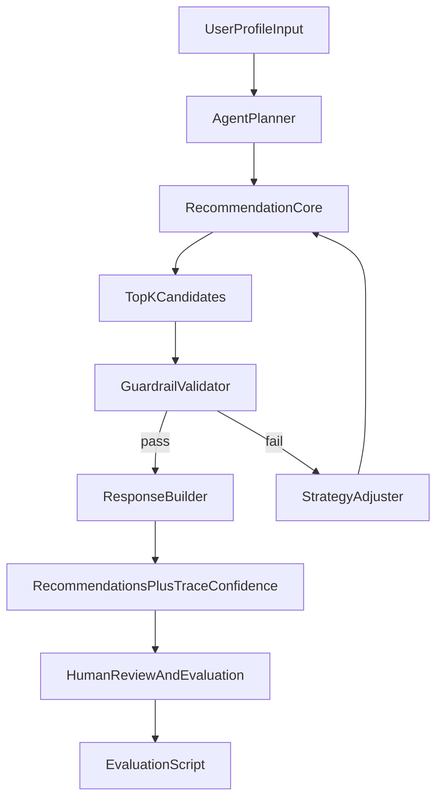

# Agentic Recommender Architecture

```mermaid
flowchart TD
  userInput[UserProfileInput] --> planner[AgentPlanner]
  planner --> recommenderCore[RecommendationCore]
  recommenderCore --> candidateSet[TopKCandidates]
  candidateSet --> validator[GuardrailValidator]
  validator -->|pass| responseBuilder[ResponseBuilder]
  validator -->|fail| strategyAdjuster[StrategyAdjuster]
  strategyAdjuster --> recommenderCore
  responseBuilder --> output[RecommendationsPlusTraceConfidence]
  output --> humanReview[HumanReviewAndEvaluation]
  humanReview --> evalHarness[EvaluationScript]
```
